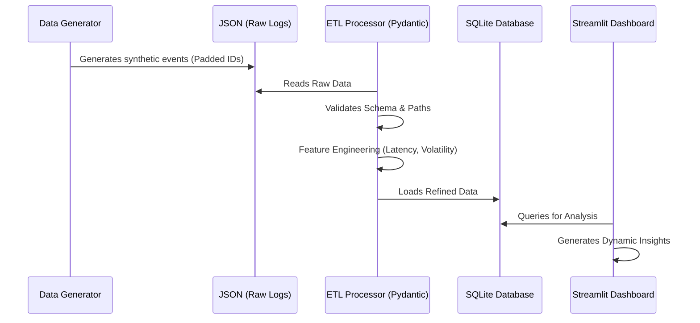
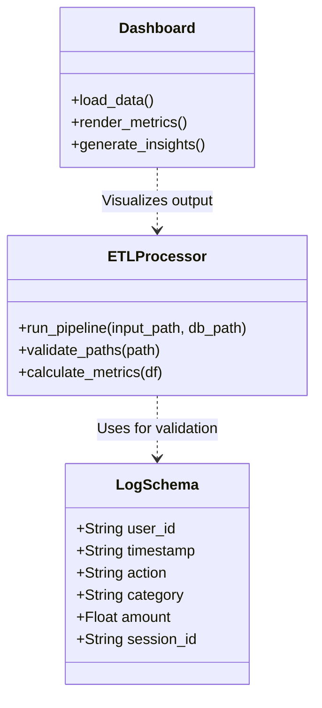
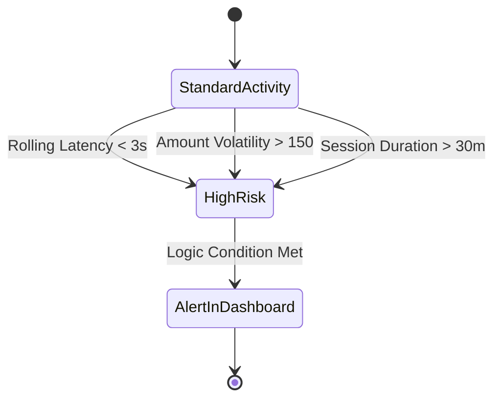

# E-commerce Behavioral Analytics Platform

An end-to-end data engineering project designed to ingest, process, and visualize complex user behavioral patterns. This project simulates a Solutions Engineering workflow: transforming raw integration data into actionable, multi-dimensional risk insights.

## Overview

The platform identifies behavioral anomalies, such as impulsivity, loss of control, and erratic spending, by processing simulated e-commerce clickstream data through a robust ETL pipeline and a dynamic intelligence dashboard.

## Tech Stack

- Language: Python 3.x
- Data Processing: Pandas
- Data Validation: Pydantic
- Security: Pathlib (Secure Path Handling)
- Storage: SQL (SQLite)
- Visualization: Streamlit and Plotly
- Data Generation: Faker

## Security Features

This platform is built with a "Security-First" approach to data engineering:

- **Path Injection Prevention**: Uses absolute path resolution and validation via `pathlib` to ensure all file I/O operations are strictly confined to the project's root directory.
- **Data Integrity Firewall**: Leverages `Pydantic` models to validate raw JSON payloads, dropping non-compliant records before they reach the processing stage.
- **SQL Safety**: Implements context managers for database connections to prevent resource leaks and ensure transactional integrity.
- **Information Leakage Protection**: Global error handling in the UI prevents the disclosure of sensitive system paths or stack traces to the end user.

## Architecture

### Data Value Chain (Sequence Diagram)

1. Data Ingestion: A generator creates raw JSON logs containing user actions, timestamps, and categories. It simulates a mix of standard users and "at-risk" segments with burst activity patterns.
2. Data Validation & Security Layer:
    - Implemented Pydantic models to enforce type-safety and business logic (e.g., non-negative transaction amounts).
    - Integrated Pathlib security to prevent Path Injection/Traversal vulnerabilities during file I/O operations.

3. ETL Pipeline:
    - Extracts raw JSON data and handles complex ISO8601 timestamp parsing.
    - Behavioral Feature Engineering:
        - Latency Analysis: Calculates rolling average intervals to detect high-frequency actions.
        - Spending Volatility: Measures the standard deviation of transaction amounts to identify erratic financial behavior.
        - Session Fatigue: Tracks cumulative session duration to monitor cognitive overload.

4. Storage: Loads the refined dataset into a relational SQL database.
5. Intelligence Dashboard: A real-time interface featuring Automated Insights that dynamically analyze data patterns (e.g., nocturnal activity detection).

## Key Features: Advanced Risk Detection

The system monitors three primary risk dimensions inspired by harm prevention methodologies:

- Impulsivity: Rapid-fire actions (e.g., frequent page refreshes or "add to cart" bursts).
- Nocturnal Activity: Automated detection of activity during "Night Watch" hours (00:00 - 05:00), often correlated with higher risk.
- Cognitive Fatigue: Identifying users with prolonged, uninterrupted session lengths.
- Financial Volatility: Flagging sudden spikes or erratic changes in spending patterns.

### Risk Classification Logic (State Diagram)

## Getting Started

- Install dependencies: pip install -r requirements.txt
- Generate raw data: python src/data_generator.py
- Run the ETL pipeline: python src/processor.py
- Launch the dashboard: streamlit run app.py

## Project Structure

- data/: Directory for raw logs and the SQLite database.
- src/data_generator.py: Script for generating synthetic behavioral data with padded User IDs.
- src/processor.py: The ETL pipeline logic with schema validation, security checks, and feature engineering.
- app.py: The Streamlit web application with dynamic analytical insights and advanced visualizations.
